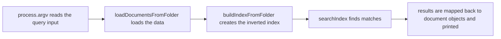

<h1>Mini Search Engine</h1>

Created a small-scale search engine with a few features currently — inverted index, tokenization, document loading, query search — and more to come as work on this project continues. The inverted index (found in `indexer.ts`) is hash-based and creates a hash table `Map<string, Set<number>>` that maps each term to the set of document id's containing it. The tokenizer normalizes the raw text into a list of searchable terms with lowercase conversion, punctuation/symbol removal, and text splitting on whitespace (“Hash Table” becomes `[“hash”, “table]`). Document loading (`loadDocumentsFromFolder` found in `cli.ts`) reads through the JSON `text-files` and parses each into document objects. The query search reads the query input (`-- <query>`) from the search command and utilizes the other three features to create a result that is sorted and ordered by how many query terms matched.
 
 

`cli.ts` is basically the command line entry point for the search engine, and it executes the four features mentioned above when the search command is run - `npm run search -- <query>`

 

 Currently, the big O complexity of the search engine is mostly linear, with `indexer.ts` looping over each document and its unique terms before creating the query response to build the index, and `searchIndex` tokenizing each term, looking each up in the map, and iterating through the posting list for matching terms. As the size of the project grows, it'll be ideal to lower the complexity down closer to constant by reducing some of the repeated work during indexing and query processing.