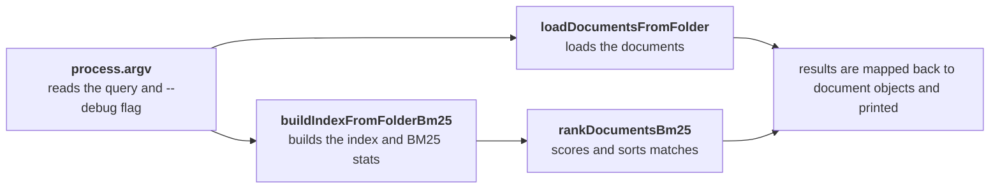
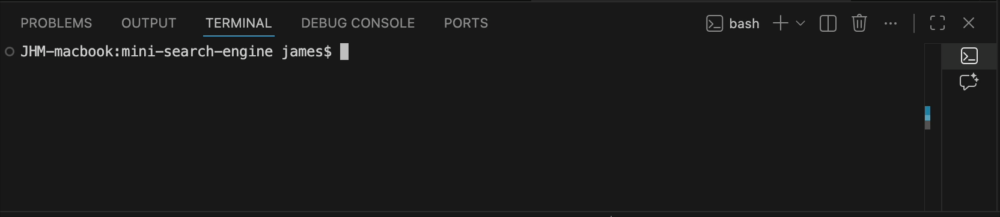
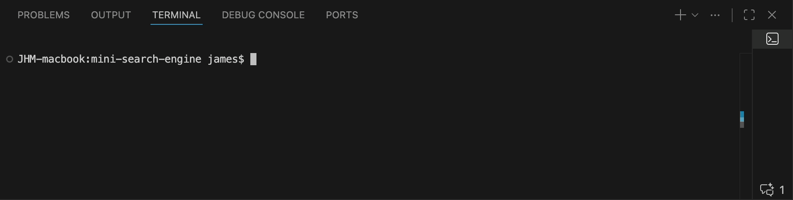

<h1>Mini Search Engine</h1>

Created a small-scale search engine that currently features a BM25 ranking layer along with tokenization, document loading, and query searching.
 

[Project Board](https://github.com/users/jmoten212/projects/2/views/1?filterQuery=)
 
 

<h3>BM25 Ranking Layer</h3>

The BM25 ranking layer gives better relevancy to the search results by ranking the searched documents based on the importance of the words contained, while accounting for repeated terms and document length. In <b>./indexer.ts</b>, [buildIndexBm25](./indexer.ts#L70) builds a map `term -> set of document id’s` that tracks `termFrequencies` - how many times each term appears in each document - `documentFrequency` - how many documents contain each term - and `documentLengths` / `averageDocumentLength` - how many tokens each document has and the corpus average.

[computeBm25Idf](./indexer.ts#L107) calculates the IDF as `ln(1 + (N - n + 0.5) / (n + 0.5))`, where `N` is the total number of documents and `n` is the number of documents containing the term. Terms found in nearly every document score close to zero.

[rankDocumentsBm25](./indexer.ts#L137) loops through the unique query terms, looks up matching docs in the index, and adds a score for each document

The [score accumulation](./indexer.ts#L165) is `current running score + IDF * TF`, where `TF = f(k1 + 1) / (f + k1(1 - b + b * docLength / avgDocLength))`; `f` is the raw count of the term in the document. The `k1` parameter (default 1.2) controls how quickly repeated terms saturate, and `b` (default 0.75) controls how strongly document length is normalized. The 'current running score' = the score a document has accumulated so far while the loop is processing query terms
 
 

<h3>Tokenizer, Document Loading, Query Search</h3>

The [tokenizer](./tokenizer.ts) normalizes the raw text into a list of searchable terms with lowercase conversion, punctuation/symbol removal, and text splitting on whitespace (“Hash Table” becomes `[“hash”, “table"]`). Document loading ([loadDocumentsFromFolder](./indexer.ts#L178) also found in <b>./indexer.ts</b>) reads through the JSON `text-files` and parses each into document objects. The query search reads the query input (`-- <query>`) from the search command and utilizes the other three features to create a result that is sorted by BM25 relevance score.
 
 

<h3>CLI</h3>

[./cli.ts](./cli.ts) is basically the command line entry point for the search engine, and it executes the four features mentioned above when the search command is run - `npm run search -- <query>`

```mermaid
graph LR
    A["<b>process.argv</b><br>reads the query and --debug flag"] --> B["<b>loadDocumentsFromFolder</b><br>loads the documents"]
    A --> C["<b>buildIndexFromFolderBm25</b><br>builds the index and BM25 stats"]
    C --> D["<b>rankDocumentsBm25</b><br>scores and sorts matches"]
    B --> E["results are mapped back to document objects and printed"]
    D --> E
```

A [--debug](./cli.ts#L5) flag was added to the CLI to check that the ranking values work as intended, and is used like `npm run search -- --debug "hash map”`. This returns the ranking values of each document containing the term
 
 

<h3>Time/Space Complexity</h3>

Currently, the big O complexity of the search engine is mostly linear, with <b>./indexer.ts</b> looping over each document and its unique terms before creating the query response to build the index, and [searchIndex](./indexer.ts#L111) tokenizing each term, looking each up in the map, and iterating through the posting list for matching terms. As the size of the project grows, the goal is to lower the complexity down closer to constant by reducing some of the repeated work during indexing and query processing.
 
 

<h2>Demo - Search Queue + Ranking</h2>

 

<h3>Contact</h3>
<b>Name:</b> James Moten  
<b>Email:</b> jmoten212@gmail.com  
<b>LinkedIn:</b> https://www.linkedin.com/in/james-moten/  
